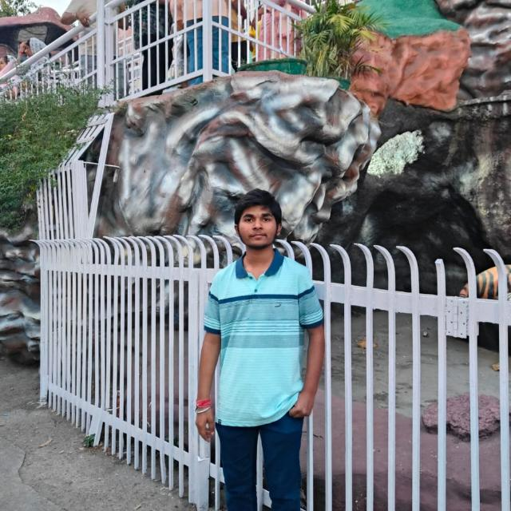

# 💫 Hi 👋, I'm Narasimha Dhoni
**BTech CSE Artificial Intelligence and Machine Learning Student || Tech Enthusiast**

Email Me 👉 ✉️ **narasimhadhoni.a@gmail.com** For Collaboration/Project or Anything Else. 😊😊

- 🌱 **I’m currently learning:** Data Structures And Algorithms Using C++
- 💬 **Ask me about:** Collaboration, Tech Support
- 📫 **How to reach me:** narasimhadhoni.a@gmail.com
- 😄 **Pronouns:** Narasimha
- ⚡ **Fun fact:** My code has more commits at midnight than in the morning.

## 🏆 GitHub Trophies

  
## 🌐 Socials:
    

<!-- Snake Game Repo View -->

  

# 💻 Tech Stack:
             
# 📊 GitHub Stats:
 
 

### ✍️ Random Dev Quote

### 🔝 Top Contributed Repo

<!-- Proudly created with GPRM ( https://gprm.itsvg.in ) -->
